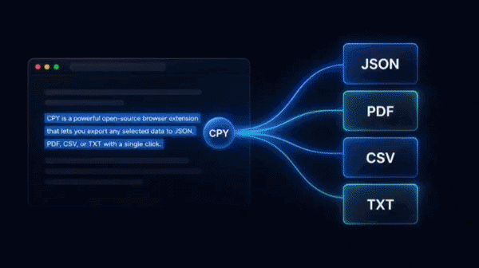
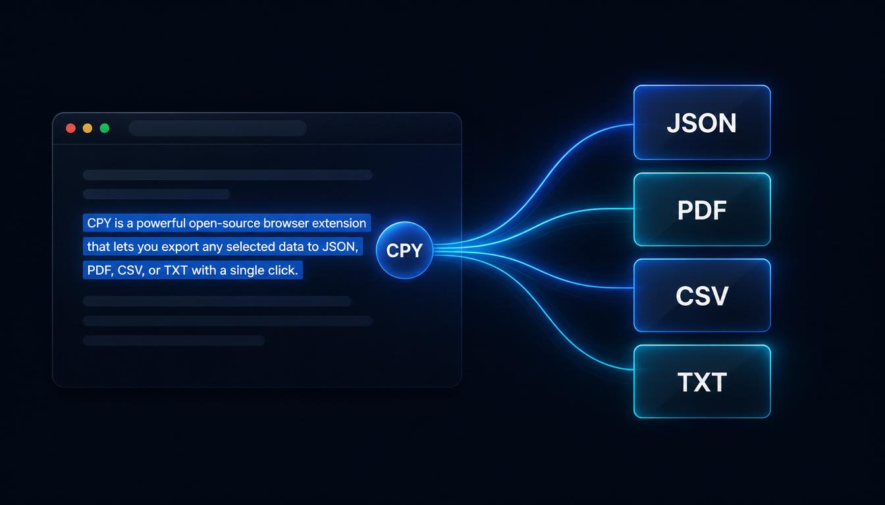

# ⚡ CPY

### Select. Save. Export.

**Capture any text with one click — 100% offline, private, and yours forever.**


<p align="center">
  
</p>


---

# ✨ What is CPY?

**CPY** is a lightweight Chrome and Firefox extension that lets you save any selected text with a single click.

Simply highlight text on any webpage, click the floating save button, and CPY stores it locally inside your browser. When you're finished, export everything as **JSON, CSV, TXT, or PDF**.

No accounts.
No cloud.
No tracking.
No internet connection required after installation.

Everything stays on your device.

---

<p align="center">
  
</p>


# 🚀 Features

| Feature | Description |
|---------|-------------|
| ⚡ One-click capture | Select any text and save it instantly with the floating button. |
| 💾 Local-first storage | Every snippet is stored only in your browser's local storage. |
| 📄 Offline exports | Export your collection as JSON, CSV, TXT, or PDF. |
| 🧹 Automatic cleanup | Removes duplicate entries, unnecessary line breaks, and messy formatting. |
| 🌐 Cross-browser | Works on both Chrome and Firefox from a single codebase. |
| 🔒 Privacy-first | No analytics, no servers, no accounts, and no tracking. |
| 🚀 Fast & lightweight | Tiny footprint with zero background services or cloud syncing. |

---

# 🧭 How It Works

```text
Select any text
        │
        ▼
⚡ Floating Save Button Appears
        │
        ▼
Click to Save
        │
        ▼
Open CPY
        │
        ▼
Export as JSON / CSV / TXT / PDF
```

That's it.

Everything happens locally inside your browser.

---

# ✅ Works On

CPY works on almost every standard webpage, including:

- Blogs
- Documentation sites
- News websites
- Research articles
- AI chat platforms
  - ChatGPT
  - Claude
  - Gemini
  - Perplexity
  - and many more...
- Any regular `http://` or `https://` webpage containing selectable text

---

# ❌ Browser Limitations

Some pages intentionally block all browser extensions.

These are browser security restrictions—not bugs in CPY.

| Location | Reason |
|----------|--------|
| Browser PDF Viewer (`file:///...pdf`) | Built-in PDF viewers are protected internal pages. |
| `chrome://`, `about:`, `edge://`, `view-source:` | Browser system pages don't allow extensions. |
| Google Docs, Sheets & Slides | They render content using `<canvas>` instead of selectable HTML text. |

### PDF Workaround

Open the PDF using any web-based PDF viewer instead of the browser's built-in viewer.

Then CPY can capture text normally.

---

# 💡 Perfect For

CPY is especially useful if you:

- Save AI-generated answers
- Collect research notes
- Build your own offline knowledge base
- Gather snippets from multiple tabs
- Archive useful articles
- Export reading sessions for later review

---

# 🔒 Privacy

Privacy is the core design principle behind CPY.

- ✅ No user accounts
- ✅ No login
- ✅ No cloud storage
- ✅ No analytics
- ✅ No telemetry
- ✅ No tracking
- ✅ No external servers
- ✅ No internet required after installation

Your data never leaves your browser.

---

# 📦 Export Formats

Export everything with one click.

Supported formats:

- JSON
- CSV
- TXT
- PDF

All exports are generated completely offline.

---

# 🤝 Contributing

Contributions are always welcome.

If you'd like to improve CPY:

- 🐛 Report bugs by opening an Issue
- 💡 Suggest new features
- 🔧 Submit a Pull Request
- ⭐ Star the repository if you find it useful

For collaborations or inquiries:

📧 **tohidul07890@gmail.com**

---

# 📜 License

Released under the **MIT License**.

Feel free to use, modify, and distribute it.

---

<p align="center">

### ⚡ Made for people who never want to lose great text.

</p>
